# Hangman

The word to guess is represented by a row of dashes representing each letter of the word. Rules may permit or forbid proper nouns, such as names, places, brands, or slang. If the guessing player suggests a letter which occurs in the word, the other player writes it in all its correct positions. If the suggested letter does not occur in the word, the other player draws one element of a hanged stick figure as a tally mark.

The player guessing the word may, at any time, attempt to guess the whole word.[citation needed] If the word is correct, the game is over and the guesser wins. Otherwise, the other player may choose to penalize the guesser by adding an element to the diagram. On the other hand, if the guesser makes enough incorrect guesses to allow the other player to complete the diagram, the guesser loses. However, the guesser can also win by guessing all the letters that appear in the word, thereby completing the word, before the diagram is completed.

[Click here to go to the live website!](https://hangman19951014.herokuapp.com/) 

## Table of contents 

1. [Plans and structure](#plans-and-structure)
    - [Objectives](#objectives)
    - [Changes throughout the process](#changes-throughout-the-process)
2. [Features](#features)
    - [Welcome page](#welcome-page)
    - [Instructions](#instructions)
    - [Game](#game)
    - [Winning message](#winning-message) 
    - [Extra features](#extra-features)
3. [Testing](#testing)
    - [Python](#python)
    - [Manual Testing](#manual-testing)
    - [Bugs](#bugs)
4. [Deployment](#deployment)
5. [Credits](#credits)
    
## Plans and structure 

  

### Objectives

- I want to create a game with clues and without clues. 
    - Was this achieved?
        - Yes
    - How was this achieved?
        - This was achieved by using a simple 1 for yes or 2 for no for each time the user needs to make a choice. 
                        
 - I want to create a special symbol that helps user to get a hint. 
    - Was this achieved?
        - Yes
    - How was this achieved?
        - If user type "*" symbol the list of array of words showed up, dependends how many letters are correct.

- To make it clear to the user how many tries they have left until the game is over.
    - Was this achieved?
        - Yes
    - How was this achieved?
        - When the user gets a guess wrong the number of tries left is printed and each round if they get the answer right or wrong it will print out the traditional hangman image that shows how many tries the user has left in the game.

- I want to give the user couple of warnings.
    - Was this achieved?
        - Yes
    - How was this achieved?
        - When the user type some symbol or number, he get a warning that explains a mistake.Also user can`t type two letters. 

### Changes throughout the process

Throughout the process of making this project I decided to change a couple of things to improve the game. 

- Originally, I had 2 different part of code for hints and without hints game.
- Also i decided to create an image of hangman.

For the first section I added another function and added an option at the end of the file to choose which game you want to play. Also I created an image of hangman, that`s took me a lot of effort and time, but hopely i done it.

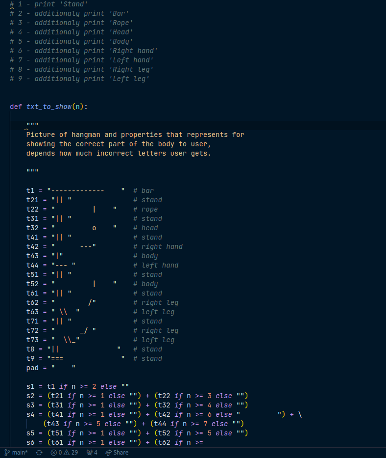

Go back to [Table of contents](#table-of-contents) 

## Features 

### Instructions 
- The fist message is showing how much words we use in this game.There is an option to play with hints or without hints.

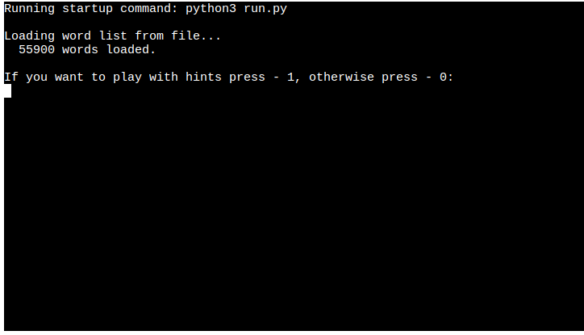

### Game
- When the user starts the game, it shows the user the length of the word they are guessing and asks the user to enter a letter.There is also displayed how many warnings user have.

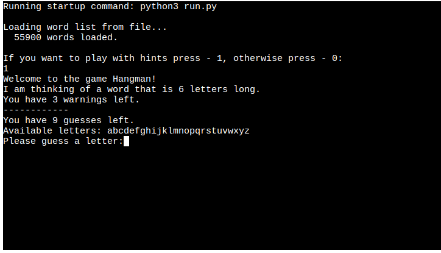

- While the user is playing the game page also shows other things such as error if letter incorrect and showing that user have less guesses.

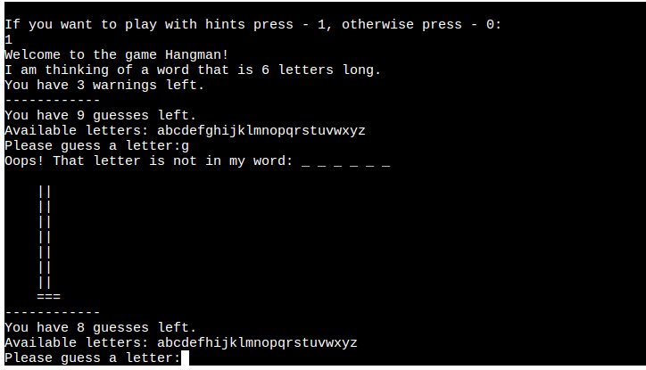

### Winning message
- If the user guesses all letter correctly it will take them to a page that congradulates user and shows your total score.

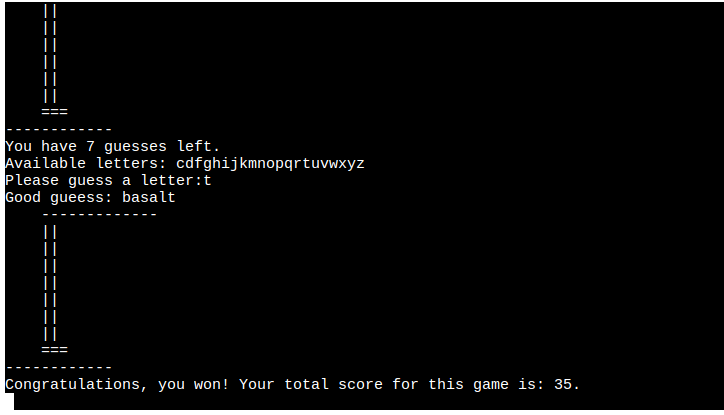

### Extra features
- I decided to create an image of hangman to make it more nicely for the user to play this game.

1. The hangman image will change throughout the game, every time the user guesses a letter wrong, the image adds a section.

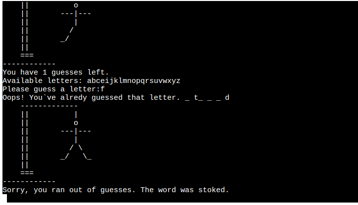

2. The user get a warning when input an intager.

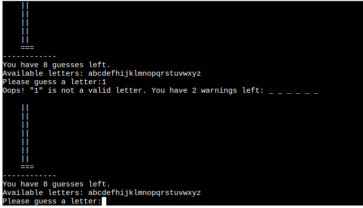

Go back to [Table of contents](#table-of-contents)

## Testing

### Python
The website pep8online.com is currently down.So I decided to add a PEP8 validator to my Gitpod Workspace directly.
Runned the command pip3 install pycodestyle.
PEP8 errors will now be underlined in red, as well as being listed in the PROBLEMS tab beside your terminal.

The Python results came back with the following:

1.run.py

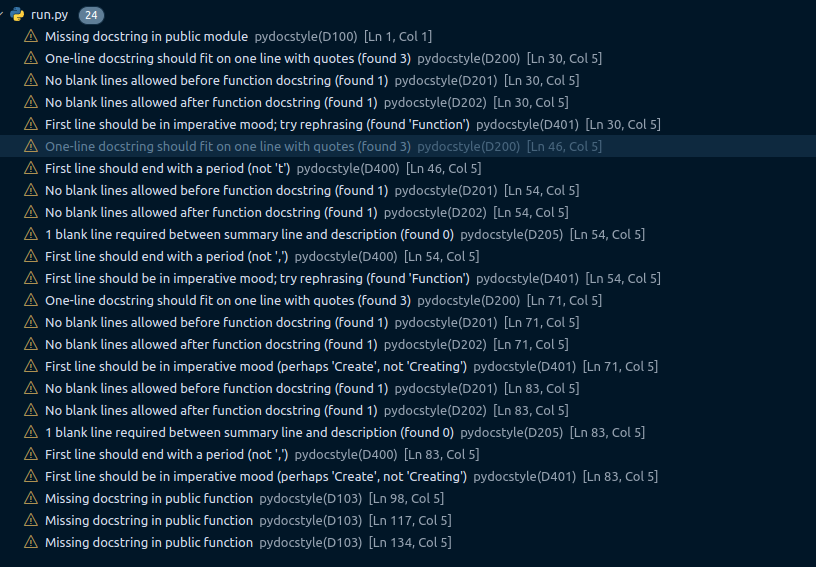

2.show_hangman.py

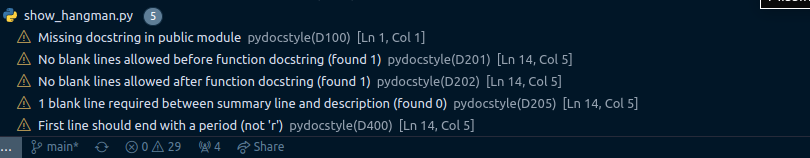

- To fix this show_hangman.py file errors I edited my docstring like that:

     

- To fix this run.py file errors I edited my docstring like that:
    
    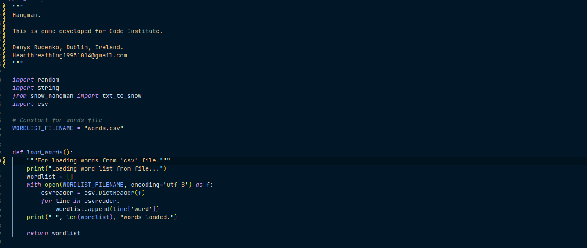 
    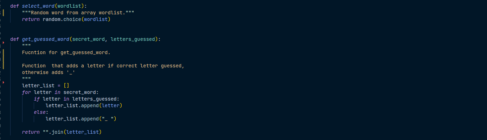 
    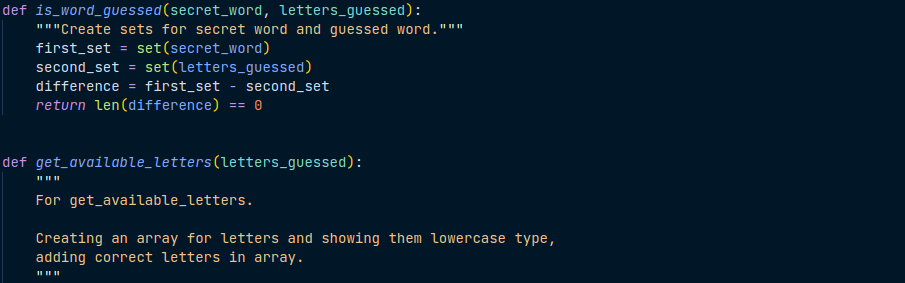 

### Manual Testing 

1. Would the user like to see the instructions?
 the user is asked to input letter. 

 - First, I tested what would happen if the user typed anything other than letter: Error message shows, results were as expected.

 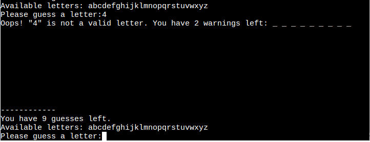 

 - Next I tested what would happen if the user end of warnings.It should start to count user number of guesses.

 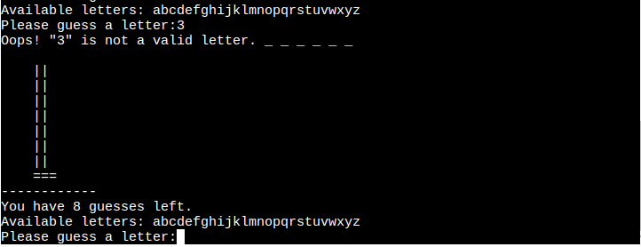

 - Last I tested what would happen if the user typed 2 letters: Results were as expected.

 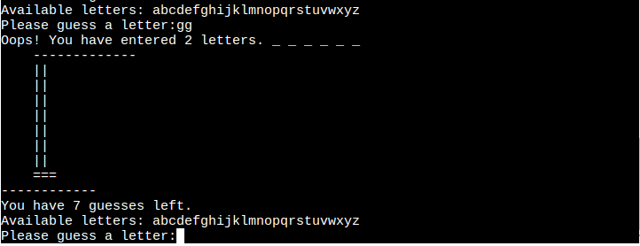 

2. I decided the change the Welcome Page.
 
 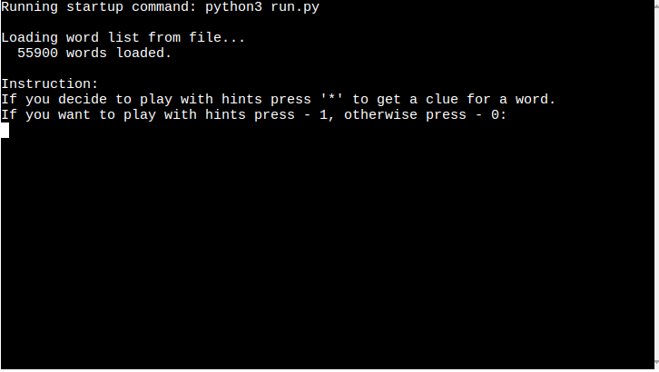 

 - Next I tested what would happen if the user fail with guesses.

 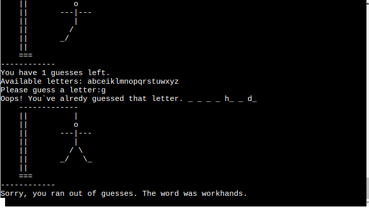

 - Next I tested what would happen if the user typed '*': User showed up a clue, results were as expected.

 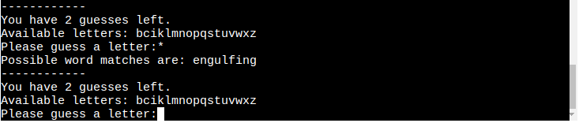 

 - Last I tested what would happen if user input 2(without clues) but the user input '*'.

  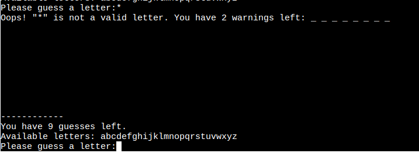 

### Bugs 
1. I found that my import didnt work, and i didnt found a solution.So I moved the function load_words.py --> run.py

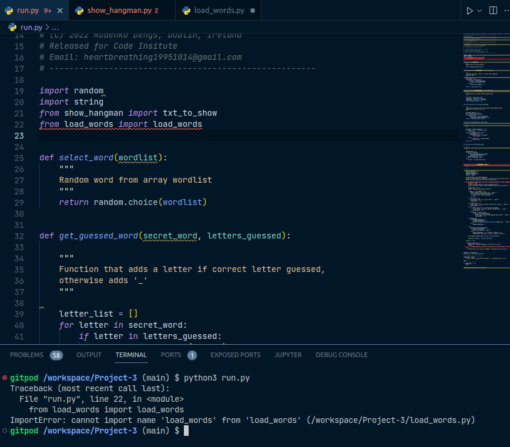  

- fixed? Yes

Go back to [Table of contents](#table-of-contents)

## Deployment 

This project was deployed using Code Institute`s mock terminal Heroku.

- Steps for deployment:
1.Fork or clone tepository.
2.Create a new Heroku app.
3.Link the heroku app to the repository.
4.Click on Deploy.

Go back to [Table of contents](#table-of-contents)

## Credits 

- Code Institute for the deplyment terminal.
- [et9719](https://www.lucidchart.com/pages/) - I used this repository for readme example.
- [Denys Rudenko](https://github.com/DenysRudenko/Python-practices/tree/master/hangman_project) - I created Hangman previously, but I modifeded some functions.

Go back to [Table of contents](#table-of-contents)